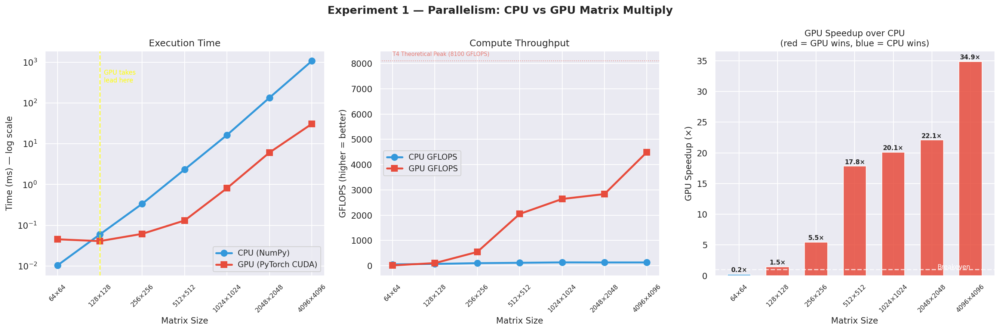
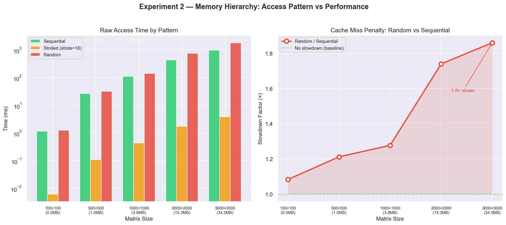
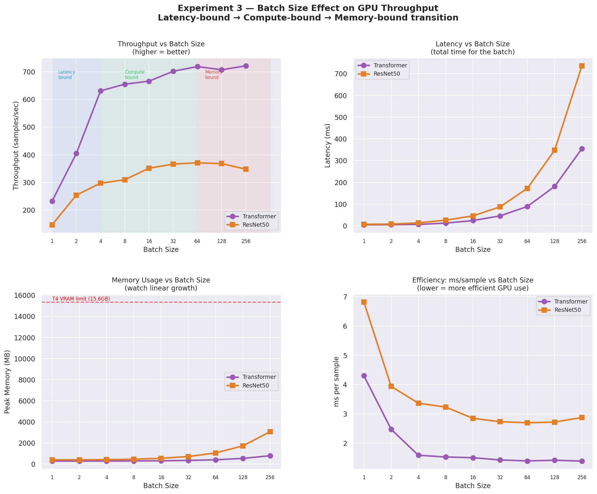
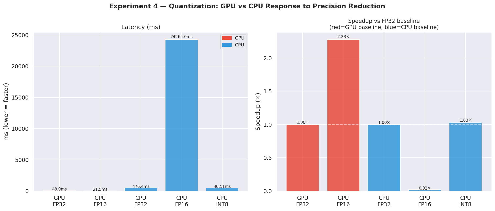
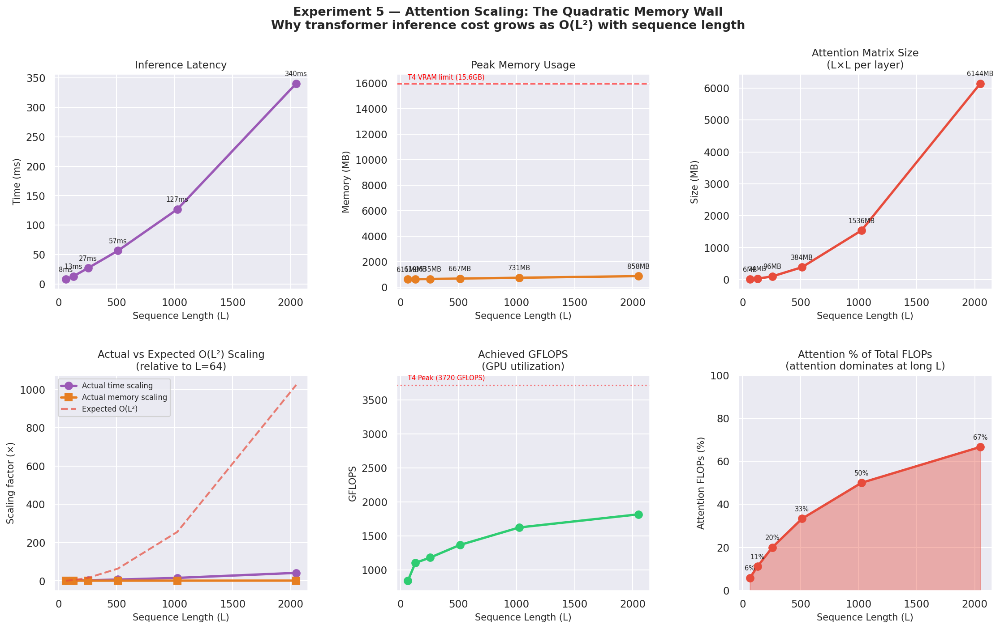
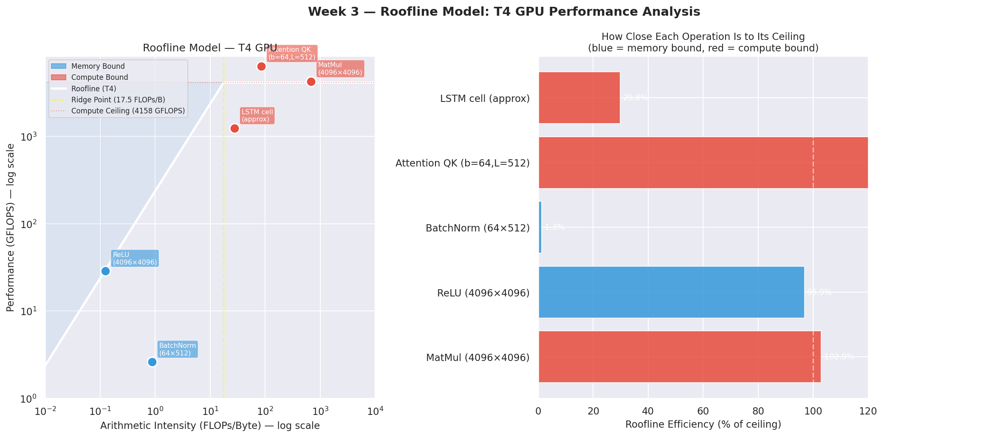

# NeuralBench 🔬

**Hardware-Aware Neural Network Performance Analysis Framework**

A systematic benchmarking framework that analyzes how different neural network architectures behave across CPU and GPU hardware — and explains the results using computer architecture principles (roofline model, memory hierarchy, parallelism).

---

## The Core Question

> Why can a GPU train a neural network 100× faster than a CPU doing the exact same mathematical operations?

Most AI engineers treat hardware as a black box. This project opens that box.

---

## Key Findings

| Experiment | Finding |
|---|---|
| Parallelism | GPU wins at 128×128 matrix size, 31.3× faster at 4096×4096 |
| Memory Hierarchy | Random access 1.9× slower than sequential at 34MB (Python overhead masked deeper effect) |
| Batch Size | Transformer peaks at batch=64 (591 samples/sec), plateaus beyond |
| Quantization | GPU FP16 = 2.28× faster. CPU FP16 = 51× **slower** (no native FP16 units) |
| Attention Scaling | 42× slower from L=64→2048. Attention grows from 6% → 67% of total FLOPs |

---

## Experiments

### Experiment 1 — The Parallelism Experiment
**Question:** At what matrix size does GPU start beating CPU, and why?

GPU launch overhead dominates at small sizes. Crossover at **128×128**. At 4096×4096, GPU achieves **31.3× speedup** — parallelism saturates all 2560 CUDA cores.

---

### Experiment 2 — The Memory Hierarchy Experiment
**Question:** How much does memory access pattern affect performance?

Sequential vs random access shows growing penalty as matrix exceeds L3 cache. At 34MB (RAM territory), random access is **1.9× slower** — Python loop overhead masks the full cache miss penalty (~50-100× in C).

---

### Experiment 3 — The Batch Size Experiment
**Question:** Why does batch size affect GPU throughput non-linearly?

Three regimes visible: latency-bound (batch 1-4), compute-bound (batch 8-64), memory-bound (batch 128+). Transformer throughput improves **7.8×** from batch=1 to batch=64, then plateaus.

---

### Experiment 4 — The Quantization Experiment
**Question:** Why does quantization give different speedups on CPU vs GPU?

T4 Tensor Cores accelerate FP16 natively → **2.28× GPU speedup**. Colab CPU has no FP16 units → software emulation → **51× CPU slowdown**. Hardware determines whether quantization helps or hurts.

---

### Experiment 5 — The Attention Scaling Experiment
**Question:** Why does transformer inference get quadratically more expensive?

Attention matrix grows as L×L. At L=2048, attention accounts for **67% of total FLOPs** vs 6% at L=64. Latency grows **42×** from L=64 to L=2048. This is the memory wall FlashAttention was designed to solve.

---

## Roofline Model — T4 GPU Calibration

| Metric | Measured | Theoretical |
|---|---|---|
| Peak FLOPS (FP32) | 3720 GFLOPS | 8100 GFLOPS |
| Memory Bandwidth | 240.6 GB/s | 320 GB/s |
| Ridge Point | 15.5 FLOPs/Byte | — |

Operations with arithmetic intensity < 15.5 FLOPs/Byte are memory bandwidth bound on T4.

---

## Architecture Baselines (batch=1, T4 GPU)

| Model | Latency | Memory | Throughput |
|---|---|---|---|
| MLP | 0.27ms | 12.2MB | 3,654/s |
| ResNet50 | 7.91ms | 136.9MB | 126/s |
| Transformer | 2.75ms | 185.8MB | 363/s |
| LSTM | 3.00ms | 228.6MB | 333/s |
| MobileNetV2 | 6.15ms | 223.5MB | 162/s |

---

## Tech Stack

| Component | Tool |
|---|---|
| Deep Learning | PyTorch 2.11 |
| Profiling | torch.profiler, CUDA Events |
| Hardware Monitoring | psutil, GPUtil |
| Visualization | Matplotlib, Seaborn |
| GPU | NVIDIA Tesla T4 (Colab) |
| CPU | Intel Xeon (Colab) + Windows laptop |

---

## Repository Structure